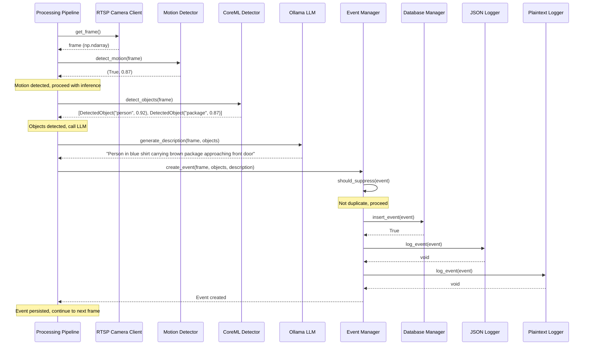

# 1. Motion-Triggered Event Creation (Happy Path)

```mermaid
sequenceDiagram
    participant Pipeline as Processing Pipeline
    participant RTSP as RTSP Camera Client
    participant Motion as Motion Detector
    participant CoreML as CoreML Detector
    participant LLM as Ollama LLM
    participant EventMgr as Event Manager
    participant DB as Database Manager
    participant JSON as JSON Logger
    participant TXT as Plaintext Logger

    Pipeline->>RTSP: get_frame()
    RTSP-->>Pipeline: frame (np.ndarray)

    Pipeline->>Motion: detect_motion(frame)
    Motion-->>Pipeline: (True, 0.87)

    Note over Pipeline: Motion detected, proceed with inference

    Pipeline->>CoreML: detect_objects(frame)
    CoreML-->>Pipeline: [DetectedObject("person", 0.92), DetectedObject("package", 0.87)]

    Note over Pipeline: Objects detected, call LLM

    Pipeline->>LLM: generate_description(frame, objects)
    LLM-->>Pipeline: "Person in blue shirt carrying brown package approaching front door"

    Pipeline->>EventMgr: create_event(frame, objects, description)

    EventMgr->>EventMgr: should_suppress(event)
    Note over EventMgr: Not duplicate, proceed

    EventMgr->>DB: insert_event(event)
    DB-->>EventMgr: True

    EventMgr->>JSON: log_event(event)
    JSON-->>EventMgr: void

    EventMgr->>TXT: log_event(event)
    TXT-->>EventMgr: void

    EventMgr-->>Pipeline: Event created

    Note over Pipeline: Event persisted, continue to next frame
```

---
