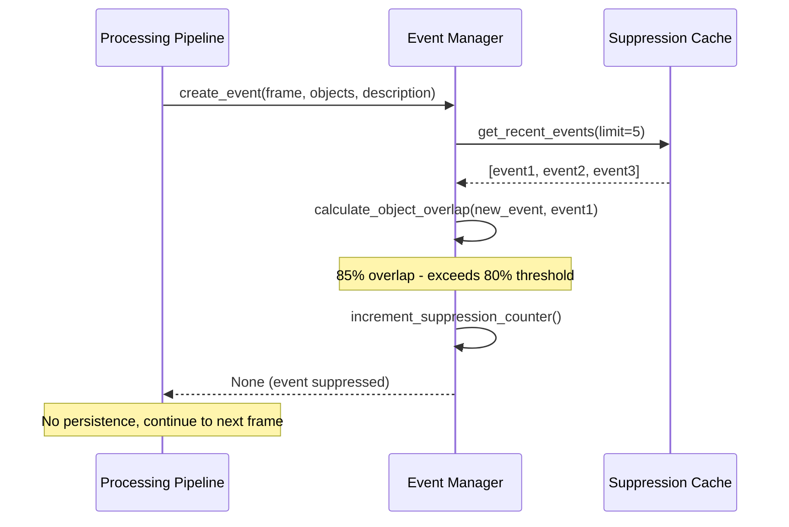

# 2. Event De-duplication (Suppression Logic)

**Suppression Algorithm:**
- Compare new event's detected object labels to last 5 events
- Calculate overlap: `len(set(new) & set(old)) / len(set(new) | set(old))`
- Suppress if overlap ≥ 80%
- Example: ["person", "package"] vs ["person", "dog"] = 1/3 = 33% → NOT suppressed
- Example: ["person", "package"] vs ["person", "package"] = 2/2 = 100% → suppressed

---
