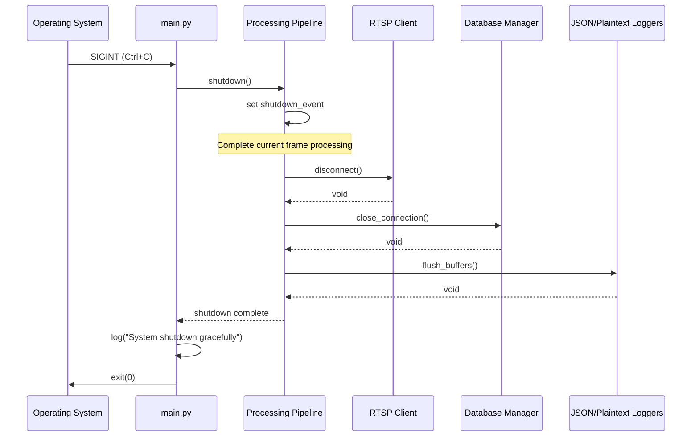

# 3. Graceful Shutdown (SIGINT/SIGTERM Handling)

**Signal Handling:**
- SIGINT (Ctrl+C): Graceful shutdown, logs "User interrupted"
- SIGTERM: Graceful shutdown, logs "Termination signal received"
- SIGHUP (Phase 2): Hot-reload configuration without restart

---
