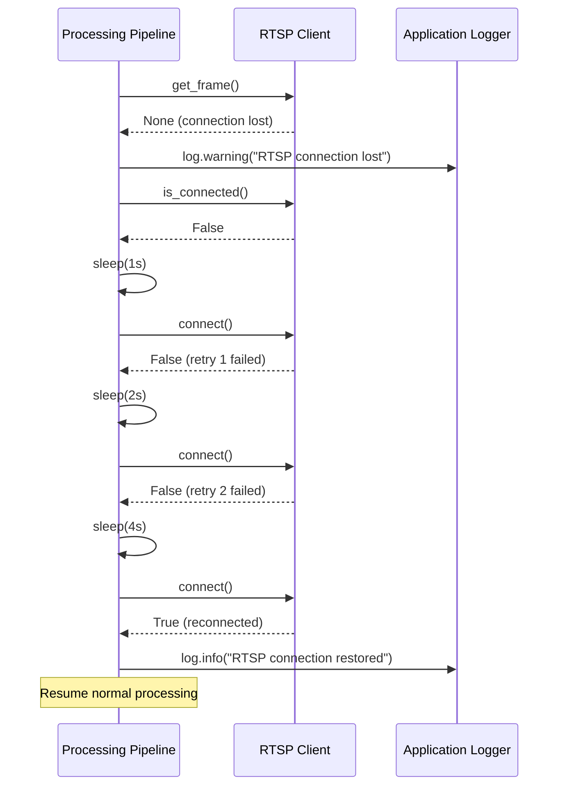

# 4. Error Recovery (RTSP Reconnection)

**Reconnection Strategy:**
- Exponential backoff: 1s, 2s, 4s, 8s (max)
- After 5 consecutive failures: log ERROR and exit
- Reset backoff counter on successful connection
- Continue processing other frames during reconnection attempts

---
