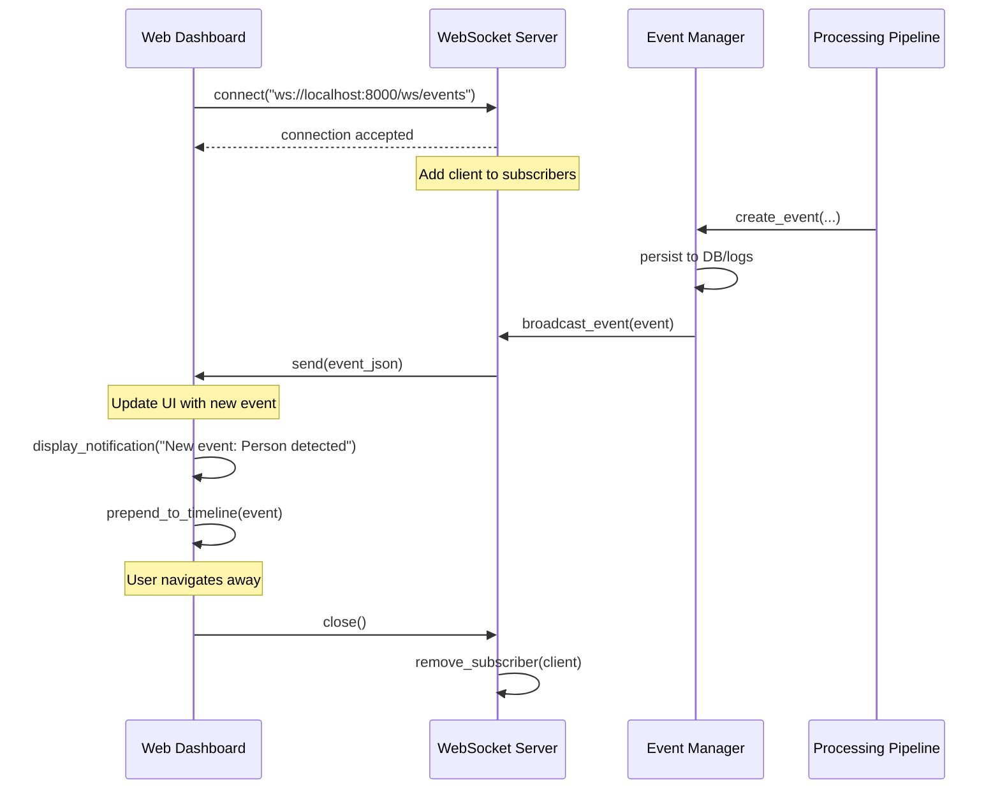

# 5. Phase 2 Real-Time Event Streaming (WebSocket)

```mermaid
sequenceDiagram
    participant WebUI as Web Dashboard
    participant WS as WebSocket Server
    participant EventMgr as Event Manager
    participant Pipeline as Processing Pipeline

    WebUI->>WS: connect("ws://localhost:8000/ws/events")
    WS-->>WebUI: connection accepted

    Note over WS: Add client to subscribers

    Pipeline->>EventMgr: create_event(...)
    EventMgr->>EventMgr: persist to DB/logs

    EventMgr->>WS: broadcast_event(event)

    WS->>WebUI: send(event_json)

    Note over WebUI: Update UI with new event

    WebUI->>WebUI: display_notification("New event: Person detected")
    WebUI->>WebUI: prepend_to_timeline(event)

    Note over WebUI: User navigates away

    WebUI->>WS: close()
    WS->>WS: remove_subscriber(client)
```

---
