# Epic 5: Web Dashboard - Architecture Diagrams

**Created:** 2025-11-10
**Author:** Winston (Architect)
**Purpose:** Visual architecture reference for Epic 5 implementation

---

## 1. System Overview - Dual Process Architecture


**Key Points:**
- Two independent processes communicating via shared SQLite database and WebSocket
- Web server has read-only database access (prevents write contention)
- Video processing pipeline remains unchanged (sole database writer)
- WebSocket enables real-time event streaming from processing to dashboard

---

## 2. Epic 5 Component Architecture


---

## 3. Real-Time Event Streaming Flow (WebSocket)


---

## 4. API Request/Response Flow


---

## 5. Frontend State Management (Observer Pattern)


**Code Example:**
```javascript
// state.js - Custom Observer Pattern
class AppState {
    constructor() {
        this.events = [];
        this.metrics = {};
        this.filters = {};
        this.listeners = new Map();
    }

    subscribe(key, callback) {
        if (!this.listeners.has(key)) {
            this.listeners.set(key, []);
        }
        this.listeners.get(key).push(callback);
    }

    set(key, value) {
        this[key] = value;
        this.notify(key, value);
    }

    notify(key, value) {
        if (this.listeners.has(key)) {
            this.listeners.get(key).forEach(cb => cb(value));
        }
    }
}

export const appState = new AppState();
```

---

## 6. Database Schema (Epic 5 Enhancements)


**Migration 003 (Epic 5):**
```sql
CREATE INDEX idx_events_timestamp ON events(timestamp DESC);
CREATE INDEX idx_events_camera ON events(camera_id);
CREATE INDEX idx_events_timestamp_camera ON events(timestamp DESC, camera_id);
CREATE INDEX idx_events_event_id ON events(event_id);
```

**Query Performance Impact:**
- Recent events query: ~10x faster (1000ms → 100ms for 10K events)
- Time-range queries: ~5x faster (500ms → 100ms)
- Camera filtering: ~8x faster (800ms → 100ms)

---

## 7. WebSocket Connection Lifecycle

```mermaid
stateDiagram-v2
    [*] --> Disconnected

    Disconnected --> Connecting: User opens dashboard
    Connecting --> Connected: Connection accepted
    Connecting --> ConnectionFailed: Network error

    Connected --> Receiving: Event broadcast
    Receiving --> Connected: Message processed

    Connected --> Reconnecting: Connection lost
    ConnectionFailed --> Reconnecting: Retry with backoff

    Reconnecting --> Connected: Reconnection successful
    Reconnecting --> Disconnected: Max retries exceeded

    Connected --> Disconnected: User closes dashboard

    note right of Reconnecting
        Exponential backoff:
        1s → 2s → 4s → 8s
    end note

    note right of Connected
        Heartbeat every 30s
        to detect stale connections
    end note
```



**WebSocket Client Logic:**
```javascript
// websocket-client.js
class WebSocketClient {
    constructor(url) {
        this.url = url;
        this.ws = null;
        this.reconnectDelay = 1000; // Start at 1s
        this.maxReconnectDelay = 8000; // Max 8s
    }

    connect() {
        this.ws = new WebSocket(this.url);

        this.ws.onopen = () => {
            console.log('WebSocket connected');
            this.reconnectDelay = 1000; // Reset on success
        };

        this.ws.onmessage = (event) => {
            const message = JSON.parse(event.data);
            if (message.type === 'event') {
                appState.set('newEvent', message.data);
            }
        };

        this.ws.onclose = () => {
            console.log('WebSocket closed, reconnecting...');
            setTimeout(() => this.connect(), this.reconnectDelay);
            this.reconnectDelay = Math.min(
                this.reconnectDelay * 2,
                this.maxReconnectDelay
            );
        };
    }
}
```

---

## 8. API Endpoint Structure

```mermaid
graph LR
    subgraph "API Routes :8000"
        Root[/ Root<br/>Serve index.html]

        subgraph "REST API /api"
            Health[/api/health<br/>GET Health Check]
            Metrics[/api/metrics<br/>GET Current Metrics]
            Events[/api/events<br/>GET List Events]
            EventByID[/api/events/:id<br/>GET Event Details]
            EventImage[/api/events/:id/image<br/>GET Annotated Image]
            Config[/api/config<br/>GET System Config]
        end

        subgraph "WebSocket"
            WSEvents[/ws/events<br/>WebSocket Stream]
        end

        subgraph "Static Files"
            Images[/images/*<br/>Serve Event Images]
            CSS[/css/*<br/>Serve Stylesheets]
            JS[/js/*<br/>Serve JavaScript]
        end
    end

    style Health fill:#c8e6c9
    style Metrics fill:#c8e6c9
    style Events fill:#c8e6c9
    style EventByID fill:#c8e6c9
    style EventImage fill:#c8e6c9
    style Config fill:#c8e6c9
    style WSEvents fill:#fff9c4
    style Images fill:#e1f5fe
    style CSS fill:#e1f5fe
    style JS fill:#e1f5fe
```

**API Endpoints Summary:**

| Endpoint | Method | Purpose | Response Time |
|----------|--------|---------|---------------|
| `/api/health` | GET | Service health status | <50ms |
| `/api/metrics` | GET | Current system metrics | <100ms |
| `/api/events` | GET | List events (paginated) | <500ms |
| `/api/events/:id` | GET | Get single event | <100ms |
| `/api/events/:id/image` | GET | Get annotated image | <200ms |
| `/api/config` | GET | System configuration | <50ms |
| `/ws/events` | WS | Real-time event stream | <1s latency |

---

## 9. Directory Structure (Epic 5 Additions)

```
video-recognition/
├── api/                          # NEW: FastAPI web server
│   ├── __init__.py
│   ├── app.py                    # FastAPI application factory
│   ├── routes/
│   │   ├── __init__.py
│   │   ├── events.py             # Event CRUD endpoints
│   │   ├── metrics.py            # System metrics endpoint
│   │   └── stream.py             # WebSocket endpoint
│   ├── dependencies.py           # DB session, metrics injection
│   └── models.py                 # API request/response models
│
├── web/                          # NEW: Frontend assets
│   ├── index.html                # Main dashboard page
│   ├── css/
│   │   ├── main.css              # Core styles
│   │   ├── components.css        # Component styles
│   │   └── layout.css            # Grid/Flexbox layout
│   └── js/
│       ├── app.js                # Application bootstrap
│       ├── state.js              # Observer pattern state
│       ├── components/
│       │   ├── event-feed.js     # Live event stream component
│       │   ├── event-detail.js   # Event detail modal
│       │   ├── metrics.js        # System health display
│       │   └── search.js         # Search and filtering
│       └── services/
│           ├── api-client.js     # REST API wrapper
│           └── websocket-client.js  # WebSocket manager
│
├── web_server.py                 # NEW: Web server entry point
│
├── migrations/
│   └── 003_add_api_indexes.sql   # NEW: API query optimization
│
├── core/                         # EXISTING (minor updates)
│   ├── event_manager.py          # UPDATED: Add WebSocket publisher
│   └── ...
│
└── tests/
    ├── api/                      # NEW: API endpoint tests
    │   ├── test_events_api.py
    │   ├── test_metrics_api.py
    │   └── test_websocket.py
    └── integration/              # NEW: Full-stack tests
        └── test_dashboard_e2e.py
```

---

## 10. Performance Optimization Strategy


**Performance Targets vs Optimizations:**

| Target | Without Optimization | With Optimization | Strategy |
|--------|---------------------|-------------------|----------|
| Dashboard load <3s | ~8s (no minification) | ~1.5s | Minify CSS/JS, gzip |
| API response <500ms | ~2s (no indexes) | ~100ms | Database indexes |
| WebSocket latency <1s | ~1s (baseline) | ~200ms | Direct EventManager integration |
| Memory <200MB | ~300MB (all events) | ~150MB | Limit to 100 events, lazy load |

---

## 11. Error Handling and Fallback Strategy

```mermaid
graph TB
    subgraph "Primary Path"
        WS[WebSocket Connection]
        LiveFeed[Live Event Feed]
    end

    subgraph "Fallback Path"
        WSFailed{WebSocket Failed?}
        Polling[REST API Polling<br/>every 5 seconds]
        EventList[Event List<br/>No live updates]
    end

    subgraph "Recovery"
        Reconnect[Exponential Backoff<br/>Reconnection]
        MaxRetries{Max Retries?}
        UserNotify[User Notification<br/>"Connection lost"]
    end

    WS --> LiveFeed
    WS -.->|Connection Error| WSFailed

    WSFailed -->|Yes| Reconnect
    Reconnect --> MaxRetries
    MaxRetries -->|Exceeded| Polling
    MaxRetries -->|Continue| WS

    Polling --> EventList
    Polling --> UserNotify

    Reconnect -.->|Success| WS

    style WS fill:#c8e6c9
    style LiveFeed fill:#c8e6c9
    style Polling fill:#fff9c4
    style EventList fill:#fff9c4
    style UserNotify fill:#ffccbc
```

**Error Scenarios:**

| Error | Detection | Recovery | User Impact |
|-------|-----------|----------|-------------|
| WebSocket connection failed | `onerror` event | Exponential backoff reconnect | ⚠️ Warning banner, fallback to polling |
| API endpoint timeout (>2s) | Fetch timeout | Retry once, then error | ❌ Error message, retry button |
| Database read error | API 500 response | Log error, return empty array | ⚠️ "No events found" message |
| Image load failed | 404 response | Show placeholder image | ℹ️ Placeholder with retry icon |

---

## 12. Deployment Architecture (Phase 2)


**Startup Process:**

```bash
# Terminal 1: Start video processing
cd /path/to/video-recognition
source venv/bin/activate
python main.py

# Terminal 2: Start web server
cd /path/to/video-recognition
source venv/bin/activate
python web_server.py

# Open browser
# http://localhost:8000
```

**Future Enhancement (Epic 6):**
```bash
# Single command startup with subprocess management
python main.py --web
# Spawns web_server.py as subprocess
# Monitors both processes
# Graceful shutdown of both on Ctrl+C
```

---

## Summary

**Epic 5 Architecture Characteristics:**

✅ **Separation of Concerns**
- Video processing and web serving in separate processes
- Read-only database access for API (no write contention)
- Static frontend assets (no build step required)

✅ **Real-Time Communication**
- WebSocket for live event streaming
- Exponential backoff reconnection
- Fallback to REST API polling

✅ **Performance Optimized**
- Database indexes for <500ms queries
- Lazy loading for images
- Virtual scrolling for long event lists

✅ **Fault Tolerant**
- Process isolation (web crash doesn't affect video processing)
- Graceful degradation (WebSocket → polling)
- User-friendly error messages

✅ **Developer Friendly**
- Zero build step (vanilla JavaScript)
- Auto-generated API docs (FastAPI/OpenAPI)
- Clear component boundaries

**Next Steps:**
1. Review diagrams for accuracy
2. Begin Story 5.1 implementation (FastAPI server setup)
3. Reference diagrams during development

---

## Change Log

| Date | Version | Description | Author |
|------|---------|-------------|--------|
| 2025-11-10 | 1.0 | Initial architecture diagrams for Epic 5 | Winston (Architect) |

