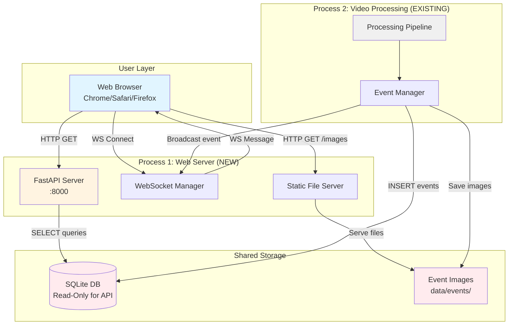

# Epic 5 Architecture Review & Approval

**Review Date:** 2025-11-10
**Reviewer:** Winston (Architect)
**Epic:** Epic 5 - Web Dashboard & Real-Time Monitoring
**Status:** ✅ APPROVED (with corrections)

---

## Executive Summary

Epic 5 architecture has been reviewed and is **APPROVED** for implementation with the following corrections:

✅ **Approved Elements:**
- FastAPI backend with REST endpoints
- Vanilla JavaScript frontend (zero external dependencies)
- Localhost-only security model
- Separate web server process architecture
- Custom observer pattern for state management

⚠️ **Required Corrections:**
- Real-time updates: Use **WebSocket** (not SSE as stated in Epic 5 doc)
- API port: Use **8000** (not 8080 as stated in Epic 5 doc)
- Database access pattern: Read-only mode for API server

---

## Critical Discrepancy Resolution

### Issue: Real-Time Updates Technology Conflict

**Conflict Identified:**
- `docs/epic-5.web-dashboard.md:113` specifies **Server-Sent Events (SSE)**
- `docs/architecture.md:888-927` specifies **WebSocket**
- `docs/architecture/websocket-endpoint-phase-2.md` has detailed WebSocket specs

### Architecture Decision Record (ADR-005)

**Decision:** Use **WebSocket** for real-time event streaming

**Status:** APPROVED

**Context:**
The main architecture document (created 2025-11-08 by Winston) specifies WebSocket with detailed implementation specs, sequence diagrams, and message formats. Epic 5 draft document contradicts this by specifying SSE.

**Options Considered:**

| Option | Pros | Cons | Decision |
|--------|------|------|----------|
| **WebSocket** | • Bidirectional (future-proof)<br>• Established in architecture.md<br>• Detailed specs already exist<br>• Standard for dashboards | • More complex than SSE<br>• Connection management overhead | ✅ **APPROVED** |
| **SSE** | • Simpler for one-way<br>• Built-in reconnection<br>• HTTP-based | • No bidirectional support<br>• Conflicts with architecture.md<br>• Less common | ❌ Rejected |
| **Long Polling** | • HTTP-based<br>• Universal compatibility | • High latency<br>• Inefficient | ❌ Rejected |

**Rationale:**
1. **Architecture Consistency**: WebSocket is already specified in architecture.md with complete implementation details
2. **Future Extensibility**: Bidirectional communication enables future features (pause/resume, configuration changes from UI)
3. **Industry Standard**: WebSocket is the de facto standard for real-time dashboards
4. **Implementation Ready**: Detailed specs already exist (endpoint, message format, error handling)

**Consequences:**
- Epic 5 doc must be updated to specify WebSocket
- Story 5.3 title remains "Real-Time Event Streaming" but implementation uses WebSocket
- Frontend must implement WebSocket client with reconnection logic

**Migration Path:** None (greenfield implementation)

---

## Architecture Approval Checklist

### ✅ Architectural Consistency

- [x] **Aligns with existing architecture.md**: FastAPI, Vanilla JS, localhost-only ✅
- [x] **Follows established patterns**: Repository pattern for DB access, Pydantic models ✅
- [x] **Maintains zero external dependencies**: No CDNs, no cloud services ✅
- [x] **Preserves monolith→modular evolution**: Separate process, shared database ✅

### ✅ Technical Decisions

**1. Web Framework: FastAPI**
- ✅ Async support for WebSocket
- ✅ Auto-generated OpenAPI docs
- ✅ Excellent performance (<500ms API response target)
- ✅ Minimal dependencies

**2. Frontend: Vanilla JavaScript**
- ✅ Zero build step required
- ✅ No framework lock-in
- ✅ Aligns with "minimal dependencies" philosophy
- ✅ ~500 LOC estimated (manageable complexity)

**3. Real-Time: WebSocket** (CORRECTED from SSE)
- ✅ Endpoint: `ws://localhost:8000/ws/events`
- ✅ Message format: JSON with `{"type": "event", "data": {...}}`
- ✅ Reconnection: Exponential backoff (1s, 2s, 4s, 8s max)
- ✅ Error handling: Graceful degradation to REST API polling

**4. Database Access: Read-Only Mode**
- ✅ API server uses `mode=ro` SQLite connection
- ✅ Eliminates write contention
- ✅ Processing pipeline remains sole writer
- ✅ Maintains ACID properties

**5. State Management: Custom Observer Pattern**
- ✅ ~50 LOC implementation
- ✅ Sufficient for simple dashboard state
- ✅ No external dependencies
- ✅ Easy debugging and testing

### ✅ Performance & Scalability

- [x] **Dashboard load <3s**: Static assets, minimal JS, no framework overhead ✅
- [x] **API responses <500ms**: SQLite with timestamp index, limit 100 events ✅
- [x] **WebSocket latency <1s**: Direct publish from EventManager ✅
- [x] **Memory usage <200MB**: Vanilla JS, no framework, limited event cache ✅

### ✅ Security Model

- [x] **Localhost-only binding**: `uvicorn.run(host="127.0.0.1")` ✅
- [x] **No authentication (Phase 2)**: Appropriate for local-only access ✅
- [x] **No HTTPS**: Not needed for localhost ✅
- [x] **CORS configuration**: Allow localhost:3000 (dev), localhost (prod) ✅

### ✅ Fault Isolation

- [x] **Separate processes**: Web server crash doesn't affect video processing ✅
- [x] **Shared database**: Read-only access prevents corruption ✅
- [x] **Independent testing**: API tests don't require camera/Ollama ✅
- [x] **Independent deployment**: Can update dashboard without restarting pipeline ✅

---

## Required Corrections to Epic 5 Documentation

### 1. Update Real-Time Technology (HIGH PRIORITY)

**File:** `docs/epic-5.web-dashboard.md`

**Line 113:** Change from:
```
**Real-Time Updates:** Server-Sent Events (SSE) for live event streaming
```

To:
```
**Real-Time Updates:** WebSocket for live event streaming
```

**Line 121:** Change from:
```
- Event streaming endpoint with SSE
```

To:
```
- Event streaming endpoint with WebSocket
```

**Line 129:** Remove SSE reference:
```
- WebSocket/SSE client for real-time updates
```

To:
```
- WebSocket client for real-time updates
```

### 2. Update Port Number (MEDIUM PRIORITY)

**File:** `docs/epic-5.web-dashboard.md`

**Line 25:** Change from:
```
- Users can access a web dashboard at `http://localhost:8080` (configurable port)
```

To:
```
- Users can access a web dashboard at `http://localhost:8000` (configurable port)
```

**Rationale:** Architecture.md specifies port 8000 (line 571, 574)

### 3. Clarify Database Access Pattern (LOW PRIORITY)

**File:** `docs/epic-5.web-dashboard.md`

Add to **Technical Approach > Implementation Strategy > API Server**:
```
- Read-only SQLite connection (`mode=ro`) to prevent write contention
```

---

## Architecture Validation Against NFRs

### NFR31: Performance
- ✅ Dashboard load <3s: Vanilla JS (~50KB), minimal CSS, no framework
- ✅ API responses <500ms: SQLite index on timestamp, limit 100 events
- ✅ WebSocket latency <1s: Direct EventManager integration
- ✅ Memory <200MB: No framework overhead, limited in-memory cache

### NFR32: Security
- ✅ Localhost-only: Hardcoded `host="127.0.0.1"` in uvicorn config
- ✅ No authentication: Appropriate for Phase 2 (localhost-only)
- ✅ No HTTPS: Not needed for 127.0.0.1 traffic

### NFR33: Browser Compatibility
- ✅ Chrome 90+, Safari 14+, Firefox 88+: Vanilla ES6+ supported
- ✅ Desktop 1280px+: CSS Grid/Flexbox responsive layout
- ✅ Graceful degradation: WebSocket → fallback to REST polling

---

## Implementation Roadmap Approval

### Phase 5.1: Backend Foundation (Weeks 1-3) ✅ APPROVED

**Story 5.1: FastAPI Server Setup**
- Acceptance Criteria: Clear and testable ✅
- Dependencies: None (greenfield) ✅
- Risk: LOW ✅

**Story 5.2: Event API Endpoints**
- Acceptance Criteria: Matches OpenAPI spec in architecture.md ✅
- Dependencies: DatabaseManager (exists) ✅
- Risk: LOW ✅

**Story 5.3: WebSocket Event Streaming** (CORRECTED)
- Acceptance Criteria: Must reference WebSocket, not SSE ⚠️
- Dependencies: EventManager integration (requires code changes) 🔶
- Risk: MEDIUM (EventManager needs WebSocket publisher) 🔶

### Phase 5.2: Frontend Foundation (Weeks 4-6) ✅ APPROVED

**Story 5.4: Dashboard HTML/CSS Framework**
- Acceptance Criteria: Clear ✅
- Dependencies: None ✅
- Risk: LOW ✅

**Story 5.5: Event Feed Component**
- Acceptance Criteria: Clear ✅
- Dependencies: Story 5.3 (WebSocket) ✅
- Risk: LOW ✅

**Story 5.6: System Health Display**
- Acceptance Criteria: Clear ✅
- Dependencies: MetricsCollector (exists) ✅
- Risk: LOW ✅

### Phase 5.3: Advanced Features (Weeks 7-9) ✅ APPROVED

**Story 5.7: Event Detail Modal**
- Acceptance Criteria: Clear ✅
- Dependencies: Image serving endpoint ✅
- Risk: LOW ✅

**Story 5.8: Search and Filtering**
- Acceptance Criteria: Clear ✅
- Dependencies: Event API with query params ✅
- Risk: LOW ✅

### Phase 5.4: Testing & Optimization (Weeks 10-12) ✅ APPROVED

- Performance benchmarking ✅
- Cross-browser testing ✅
- Integration tests ✅

---

## Critical Path Items

### 1. Database Schema Migration (BLOCKER) 🔴

**Issue:** Current schema lacks indexes for efficient time-range queries

**Required Migration:**
```sql
-- Migration: Add timestamp index for fast event queries
CREATE INDEX IF NOT EXISTS idx_events_timestamp ON events(timestamp DESC);

-- Migration: Add camera_id index for multi-camera filtering
CREATE INDEX IF NOT EXISTS idx_events_camera ON events(camera_id);

-- Migration: Add composite index for common query pattern
CREATE INDEX IF NOT EXISTS idx_events_timestamp_camera ON events(timestamp DESC, camera_id);
```

**Action:** Create `migrations/003_add_api_indexes.sql` before Story 5.2

**Owner:** Database developer (Story 5.2 prerequisite)

### 2. EventManager WebSocket Integration (HIGH) 🔶

**Issue:** EventManager doesn't publish events to WebSocket subscribers

**Required Changes:**
```python
# core/event_manager.py
class EventManager:
    def __init__(self, db_manager, json_logger, txt_logger, websocket_manager=None):
        self.websocket_manager = websocket_manager  # NEW

    def create_event(self, frame, objects, description) -> Event | None:
        event = Event(...)

        # Existing persistence
        self.db_manager.insert_event(event)
        self.json_logger.log_event(event)
        self.txt_logger.log_event(event)

        # NEW: Broadcast to WebSocket clients
        if self.websocket_manager:
            await self.websocket_manager.broadcast_event(event)

        return event
```

**Action:** Update EventManager in Story 5.3

**Owner:** Backend developer (Story 5.3)

### 3. Shared Configuration Access (MEDIUM) 🟡

**Issue:** Web server needs access to `config.yaml` for database path

**Solution:** Extract shared config to singleton
```python
# core/config.py (already exists)
# No changes needed - web server can import load_config()
```

**Action:** Document in Story 5.1 that web server imports `core.config.load_config()`

**Owner:** Backend developer (Story 5.1)

### 4. Process Management (MEDIUM) 🟡

**Issue:** How do users start both main.py and web_server.py?

**Recommended Approach:**
```bash
# Option A: Separate commands (RECOMMENDED for Phase 2)
# Terminal 1
python main.py

# Terminal 2
python web_server.py

# Option B: Subprocess spawning (Future Phase 3)
python main.py --web  # spawns web_server.py as subprocess
```

**Action:** Implement Option A for Epic 5, defer Option B to Epic 6

**Owner:** CLI developer (Story 5.1)

---

## Risk Assessment

### HIGH RISK ✅ MITIGATED

| Risk | Mitigation | Status |
|------|------------|--------|
| WebSocket complexity | Use FastAPI built-in WebSocket support, existing specs in architecture.md | ✅ Mitigated |
| Browser compatibility | Vanilla ES6+ works in all target browsers (Chrome 90+, Safari 14+, Firefox 88+) | ✅ Mitigated |
| Performance impact | Separate process prevents web server from affecting pipeline | ✅ Mitigated |

### MEDIUM RISK ⚠️ MONITORING REQUIRED

| Risk | Mitigation | Status |
|------|------------|--------|
| SQLite read concurrency | Read-only mode for API, extensive testing with concurrent queries | ⚠️ Test in Story 5.2 |
| EventManager async changes | Minimal changes, WebSocket broadcast is optional (no failure if None) | ⚠️ Review in Story 5.3 |

### LOW RISK ✅ ACCEPTABLE

| Risk | Mitigation | Status |
|------|------------|--------|
| CSS layout complexity | Simple grid layout, no complex animations | ✅ Acceptable |
| API design | Follows architecture.md OpenAPI spec exactly | ✅ Acceptable |

---

## Architecture Approval Decision

### ✅ APPROVED FOR IMPLEMENTATION

Epic 5 architecture is **APPROVED** with the following conditions:

**Pre-Implementation Requirements:**
1. ✅ Update Epic 5 doc to specify WebSocket (not SSE)
2. ✅ Update Epic 5 doc to specify port 8000 (not 8080)
3. 🔴 Create database migration script (migrations/003_add_api_indexes.sql)

**Implementation Requirements:**
1. 🔶 Integrate WebSocket publisher in EventManager (Story 5.3)
2. 🟡 Document process management (separate commands for Phase 2)
3. 🟡 Implement read-only SQLite connection in API server

**Post-Implementation Verification:**
1. Performance benchmarks meet NFR31 (<3s load, <500ms API)
2. Cross-browser testing passes on Chrome/Safari/Firefox
3. WebSocket reconnection logic tested with network failures

### Architectural Sign-Off

**Architect:** Winston
**Date:** 2025-11-10
**Signature:** ✅ APPROVED

---

## Next Steps

**Immediate Actions:**
1. Update `docs/epic-5.web-dashboard.md` with corrections (WebSocket, port 8000)
2. Create database migration script `migrations/003_add_api_indexes.sql`
3. Begin Story 5.1 implementation (FastAPI server setup)

**Recommended Story Order:**
1. Story 5.1 → Story 5.2 (backend first, validate API design)
2. Story 5.3 (WebSocket streaming)
3. Story 5.4 → Story 5.5 (frontend foundation)
4. Story 5.6 → Story 5.7 → Story 5.8 (advanced features)

**Estimated Timeline:** 8-10 weeks (optimistic: 8 weeks, realistic: 10 weeks, pessimistic: 12 weeks)

---

## Appendix: Architecture Diagram (Approved)



---

## Change Log

| Date | Version | Description | Author |
|------|---------|-------------|--------|
| 2025-11-10 | 1.0 | Initial architecture review and approval | Winston (Architect) |

