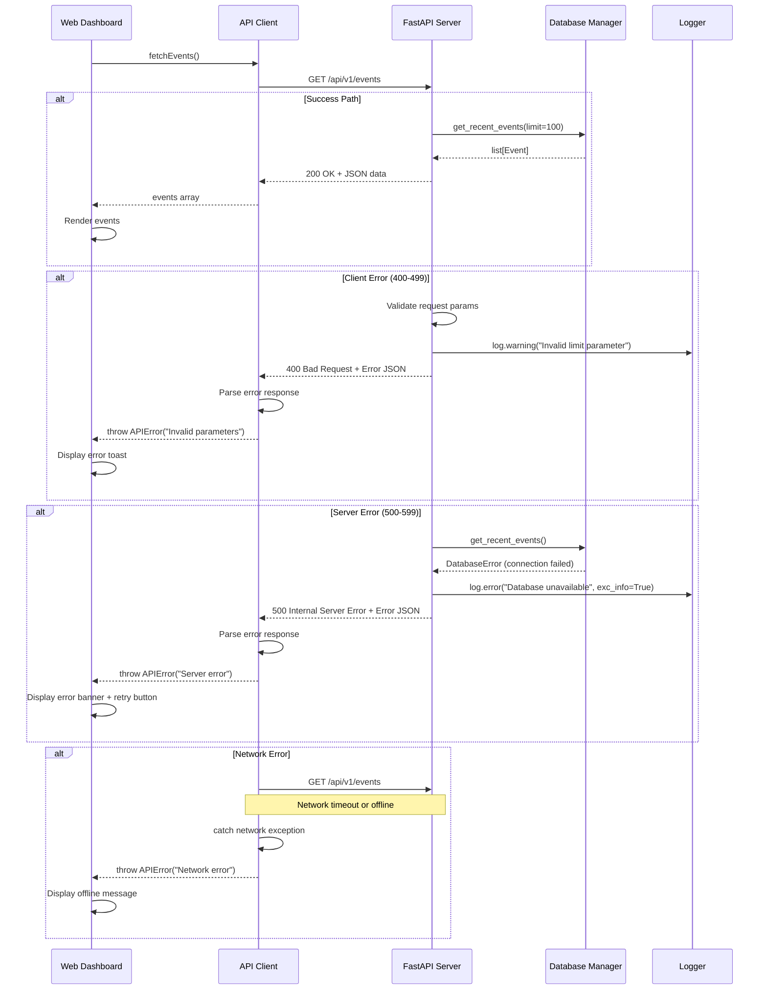

# Error Flow

## End-to-End Error Flow (Frontend → Backend → Frontend)

```mermaid
sequenceDiagram
    participant UI as Web Dashboard
    participant API as API Client
    participant Server as FastAPI Server
    participant DB as Database Manager
    participant Log as Logger

    UI->>API: fetchEvents()
    API->>Server: GET /api/v1/events

    alt Success Path
        Server->>DB: get_recent_events(limit=100)
        DB-->>Server: list[Event]
        Server-->>API: 200 OK + JSON data
        API-->>UI: events array
        UI->>UI: Render events
    end

    alt Client Error (400-499)
        Server->>Server: Validate request params
        Server->>Log: log.warning("Invalid limit parameter")
        Server-->>API: 400 Bad Request + Error JSON
        API->>API: Parse error response
        API-->>UI: throw APIError("Invalid parameters")
        UI->>UI: Display error toast
    end

    alt Server Error (500-599)
        Server->>DB: get_recent_events()
        DB-->>Server: DatabaseError (connection failed)
        Server->>Log: log.error("Database unavailable", exc_info=True)
        Server-->>API: 500 Internal Server Error + Error JSON
        API->>API: Parse error response
        API-->>UI: throw APIError("Server error")
        UI->>UI: Display error banner + retry button
    end

    alt Network Error
        API->>Server: GET /api/v1/events
        Note over API,Server: Network timeout or offline
        API->>API: catch network exception
        API-->>UI: throw APIError("Network error")
        UI->>UI: Display offline message
    end
```

---
