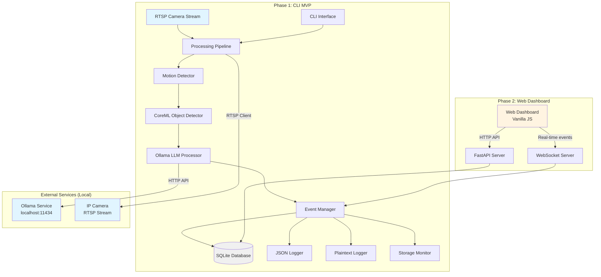

# High Level Architecture Diagram

```mermaid
graph TB
    subgraph "Phase 1: CLI MVP"
        Camera[RTSP Camera Stream]
        CLI[CLI Interface]
        Pipeline[Processing Pipeline]
        Motion[Motion Detector]
        CoreML[CoreML Object Detector]
        LLM[Ollama LLM Processor]
        EventMgr[Event Manager]
        DB[(SQLite Database)]
        JSONLog[JSON Logger]
        TxtLog[Plaintext Logger]
        Storage[Storage Monitor]

        Camera --> Pipeline
        CLI --> Pipeline
        Pipeline --> Motion
        Motion --> CoreML
        CoreML --> LLM
        LLM --> EventMgr
        EventMgr --> DB
        EventMgr --> JSONLog
        EventMgr --> TxtLog
        EventMgr --> Storage
    end

    subgraph "Phase 2: Web Dashboard"
        WebUI[Web Dashboard<br/>Vanilla JS]
        API[FastAPI Server]
        WS[WebSocket Server]

        WebUI -->|HTTP API| API
        WebUI -->|Real-time events| WS
        API --> DB
        WS --> EventMgr
    end

    subgraph "External Services (Local)"
        OllamaService[Ollama Service<br/>localhost:11434]
        RTSPCam[IP Camera<br/>RTSP Stream]
    end

    LLM -->|HTTP API| OllamaService
    Pipeline -->|RTSP Client| RTSPCam

    style Camera fill:#e1f5ff
    style OllamaService fill:#e1f5ff
    style RTSPCam fill:#e1f5ff
    style WebUI fill:#fff4e1
    style DB fill:#f0f0f0
```
